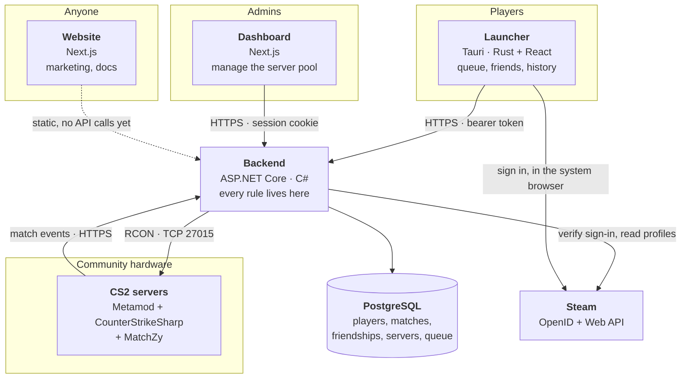
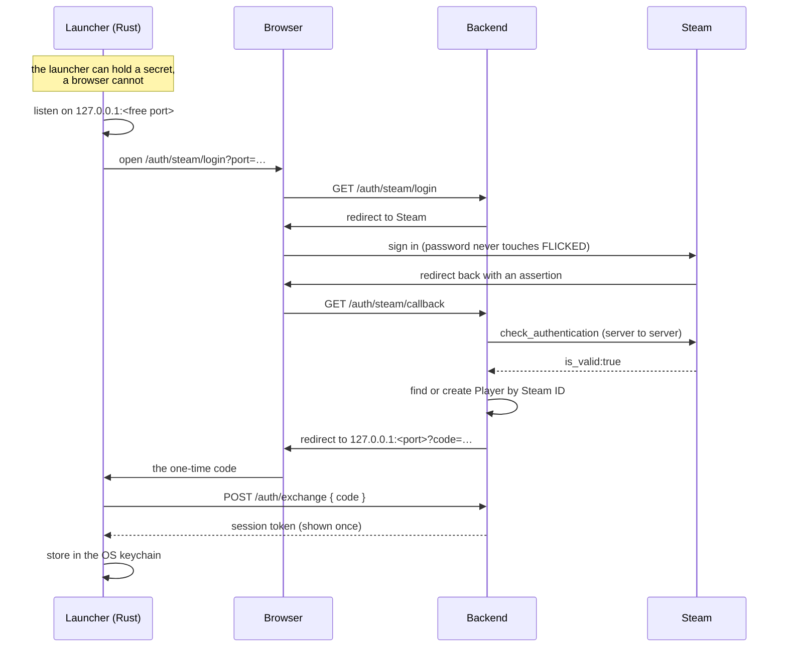
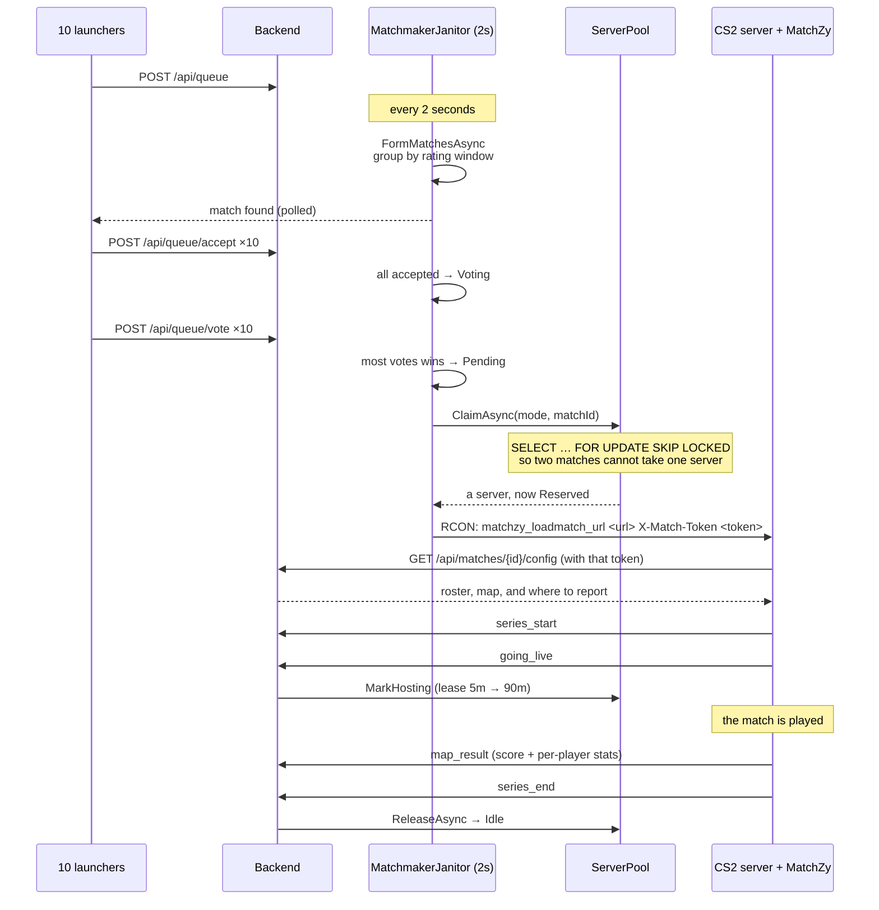
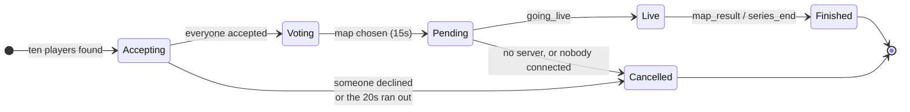
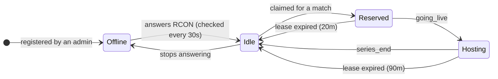
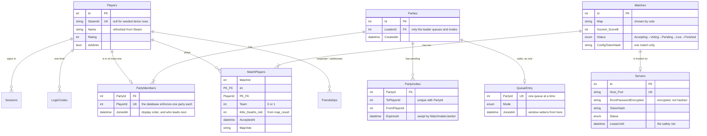
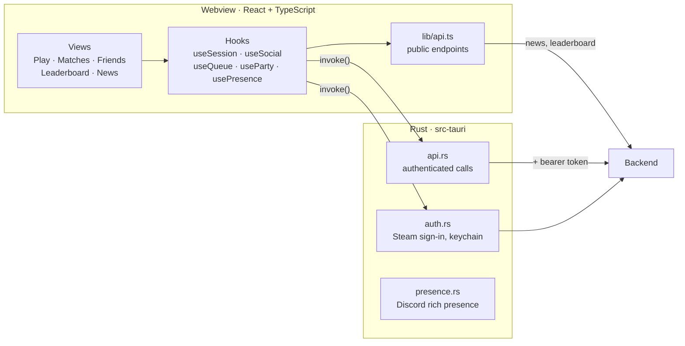
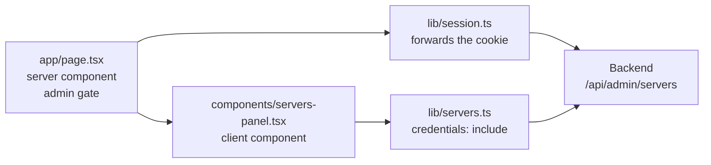

# How FLICKED fits together

Four programs and a database. The backend owns every decision; everything else
asks it. This document is the map: what talks to what, in what order, and which
piece is trusted with what.

If a diagram disagrees with the code, the code is right and this file is stale.

---

## 1. The whole system

**The rule that shapes everything:** the backend decides, the clients display.
No client is trusted with identity, match results, or who may do what.

---

## 2. Inside the backend

```mermaid
graph TB
    subgraph controllers["Controllers · HTTP"]
        auth["AuthController<br/>sign-in, sessions, /me"]
        queue["QueueController<br/>join, accept, vote"]
        friends["FriendsController"]
        party["PartyController<br/>invite, accept, kick"]
        social["SocialController<br/>/api/social/state, polled"]
        matches["MatchesController<br/>your history"]
        news["NewsController<br/>LeaderboardController"]
        adminSrv["AdminServersController<br/>the pool, admin only"]
        srvApi["MatchServerController<br/>ServersController<br/>called by CS2 servers"]
    end

    subgraph services["Services · the rules"]
        currentPlayer["CurrentPlayer<br/>token or cookie → Player"]
        serverAuth["ServerAuth<br/>X-Server-Token → GameServer"]
        steamOpenId["SteamOpenId · SteamProfile"]
        matchmaker["Matchmaker<br/>queue → matches, phases"]
        partySvc["Parties<br/>who may join, leave, invite"]
        socialSvc["Social<br/>party state for a screen"]
        pool["ServerPool<br/>claim · release · sweep"]
        starter["MatchStarter<br/>token + RCON command"]
        rcon["Rcon<br/>Source RCON client"]
        secrets["Secrets · ServerSecrets<br/>hash what you check,<br/>encrypt what you replay"]
    end

    subgraph loops["Background loops"]
        poolJanitor["PoolJanitor · 30s<br/>expire leases, check servers"]
        mmJanitor["MatchmakerJanitor · 2s<br/>form, advance, start,<br/>sweep expired invites"]
    end

    db[("PostgreSQL · EF Core")]

    auth --> steamOpenId
    auth --> currentPlayer
    queue --> currentPlayer
    friends --> currentPlayer
    party --> currentPlayer
    party --> partySvc
    party --> socialSvc
    social --> currentPlayer
    social --> socialSvc
    queue --> partySvc
    matches --> currentPlayer
    adminSrv --> currentPlayer
    adminSrv --> starter
    adminSrv --> secrets
    srvApi --> serverAuth
    srvApi --> pool

    mmJanitor --> matchmaker
    mmJanitor --> partySvc
    mmJanitor --> pool
    mmJanitor --> starter
    poolJanitor --> pool
    pool --> rcon
    starter --> rcon
    starter --> secrets

    controllers --> db
    services --> db
    loops --> db
```

Controllers are thin: authenticate, validate, call a service, shape a response.
Anything with a rule in it (who may claim a server, what a fair match is, when a
lease has expired) lives in a service, so the matchmaker and an admin pressing a
button go through exactly the same code.

---

## 3. Signing in

Two clients, two ways to carry a session, one `Sessions` table.

**Why a code rather than the token:** URLs end up in browser history and logs.
The code is single-use, expires in two minutes, and the token only ever travels
in a request the launcher makes itself.

**The dashboard** uses the same verification but ends differently: the backend
sets an **HttpOnly cookie** and redirects back, because a browser cannot keep a
token safely. `CurrentPlayer` accepts either.

**Verification is server to server.** Everything arriving from the browser is a
claim; only Steam confirming it makes it true.

---

## 4. A match, start to finish

**The config carries its own reporting settings**, so a stock MatchZy needs
nothing configured by hand beyond an RCON password.

**MatchZy never retries and never deduplicates.** So every handler is idempotent,
and the lease is the safety net: a lost `series_end` cannot strand a server.

---

## 5. Two state machines

The lease arrows are the ones that matter. Without them, one crashed server
leaves the pool silently and forever.

---

## 6. The data

**Every queue entry is a party**, and somebody playing alone is a party of one.
There is no second shape of queue entry for solo players, so there is no solo
path for the party path to disagree with: the matchmaker only ever asks how many
seats a row takes and what it is rated.

**Derived, never stored:** a player's rank, win rate, K/D and ADR; a match's
result; whether a server is free. Anything stored twice eventually disagrees
with itself.

---

## 7. Who is trusted with what

| Credential | Held by | Stored as | Proves |
|---|---|---|---|
| Session token | Launcher, in the OS keychain | SHA-256 hash | you are this player |
| Session cookie | Browser, HttpOnly | the same `Sessions` row | you are this admin |
| Server token | A CS2 server's config | SHA-256 hash | this is that server |
| Match token | Sent in the RCON command | SHA-256 hash | this is that one match |
| RCON password | The backend | **encrypted** (Data Protection) | lets FLICKED command a server |

**Hash what you only check; encrypt what you have to replay.** An RCON password
has to be sent again, so it cannot be hashed; everything else is only ever
compared, so it is never stored in a form anyone could use.

**The launcher's webview never sees a token.** Rust holds it, makes the
authenticated calls, and hands the interface names and numbers only, so a
scripting bug in the UI cannot walk off with a session.

---

## 8. Inside the launcher

**The split:** public data (news, leaderboard) is fetched straight from the
webview; anything about *you* goes through Rust, because that is where the token
lives. Each authenticated endpoint gets its own command rather than one general
"call this path", so a compromised webview cannot borrow the token freely.

---

## 9. Inside the dashboard

**Two gotchas worth knowing**, both of which cost time here:

- A **server component's** fetch does not carry the browser's cookies. They have
  to be read with `next/headers` and forwarded by hand, or every request looks
  signed out.
- A **client component's** fetch needs `credentials: "include"`, and the backend
  must name the dashboard's origin in CORS: a wildcard is refused once
  credentials are involved.

The admin check runs on the server on every request, with no caching, so a
revoked session or a removed admin flag takes effect immediately.

---

## 10. What runs on a timer

| Loop | Every | Does |
|---|---|---|
| `MatchmakerJanitor` | 2s | form matches, advance accept/vote phases, start ready matches |
| `PoolJanitor` | 30s | reclaim expired leases, check each server over RCON |

Both open a fresh DI scope per pass (a `BackgroundService` is a singleton and
must never hold a `DbContext`) and swallow exceptions, because one bad pass must
not end the loop for the life of the process.

---

## Where the seams are

Things deliberately left as boundaries, so they can be replaced without touching
the rest:

- **The pool answers one question:** "give me a server for this match". Today the
  answer comes from a table of registered servers; automatic provisioning would
  be another way a row appears, and matchmaking would never notice.
- **MatchZy sits behind two endpoints** (a config and an event feed). A custom
  CounterStrikeSharp plugin would speak the same two.
- **Presence and the queue are polled today.** SignalR would replace the polling
  without changing what the screens render.
