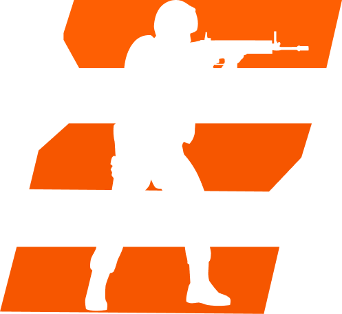

# FLICKED



[](https://github.com/viix0dev/FLICKED/releases)


**FLICKED** is a free open-source self-hostable competitive platform for CS2: matchmaking,
parties, ratings, match history and demos.

You bring the CS2 servers. FLICKED finds the players, makes the match, tells one of your
servers to run it, and records what happened.

> **Alpha software.** Things will change and break. If something's off, that's worth
> reporting, not assuming is expected.

---

## What FLICKED does

- **Matchmaking.** Queue solo or with a party, get matched with players of a similar rating.
- **Map vote.** Everyone accepts, then everyone votes. Highest vote wins, ties are random.
- **Server pool.** Server owners register their CS2 servers once. FLICKED hands one out per
  match and takes it back when the match ends.
- **Ratings and history.** Every match updates ratings and is kept, with its demo.
- **Self-hosting.** One `docker compose up` for the backend and database.

## What FLICKED does not do

Being clear about this saves everyone time:

- **It does not create or host CS2 servers for you.** It coordinates servers you already run.
- **It does not ship an anti-cheat.** Use a community anti-cheat on your servers if you need one.
- **It is not a Valve service** and has nothing to do with official CS2 matchmaking.

Why these lines are drawn where they are: [ROADMAP.md](./ROADMAP.md).

---

## Tech stack

| Part | Built with |
|---|---|
| Launcher | Rust + Tauri, React and TypeScript in the webview |
| Website | Next.js and Tailwind |
| Backend | C# and .NET 10 (ASP.NET Core) |
| Database | PostgreSQL |
| CS2 side | CounterStrikeSharp plugin (planned; MatchZy at first) |

## Structure

> Every folder contains documentation describing how that part works.

| Path | What's in it |
|---|---|
| `./assests/` | Images, logos and other shared assets |
| `./website/` | Public website |
| `./dashboard/`| Admins dashboard |
| `./backend/` | API and database code (`Flicked.slnx` opens it) |
| `./launcher/` | Desktop launcher |
| `./docker-compose.yml` | PostgreSQL for local development |
| `./DESIGN.md` | The design system shared by the website and launcher |
| `./ROADMAP.md` | What's next, and why the plan looks like this |

## Running it locally

You need [Docker](https://www.docker.com/products/docker-desktop/), the
[.NET 10 SDK](https://dotnet.microsoft.com/download) and [Node.js](https://nodejs.org/).

```bash
# 1. database
docker compose up -d

# 2. backend (http://localhost:5165)
cd backend/Flicked.Api
dotnet run --launch-profile https

# 3. launcher
cd launcher
npm install
npm run tauri dev
```
