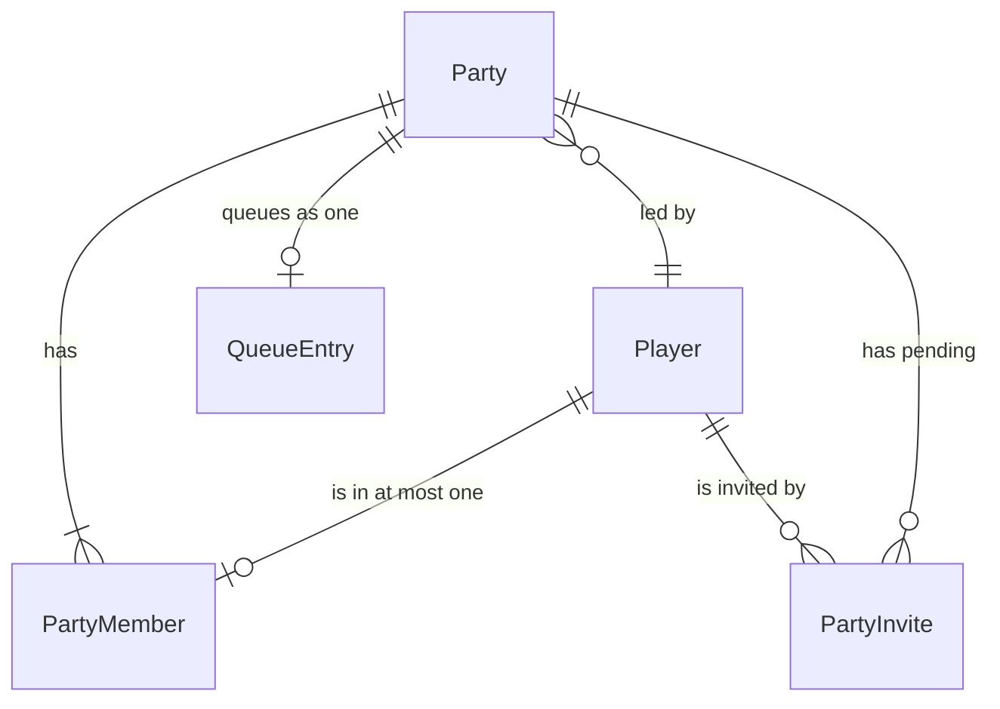
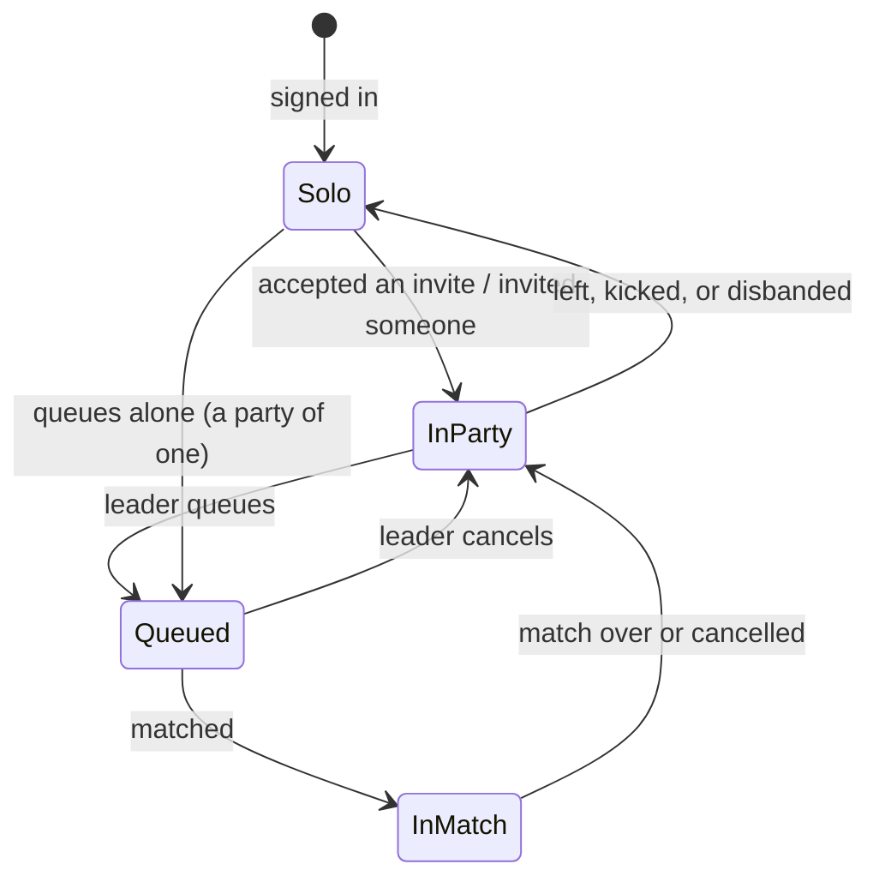

# Parties

A plan for queueing with friends, and for what that does to matchmaking.

Today a party exists only in the launcher, where `useParty` looks a friend up in
a hardcoded demo array and a `setTimeout` pretends they accepted. The backend has
no party table, no party endpoints, and a queue that holds one row per player.
This document is how that becomes real.

---

## The decision everything else follows from

**Every queue entry is a party. A solo player is a party of one.**

The alternative is a nullable `PartyId` on the existing per-player queue row, with
the matchmaker grouping rows back together on every pass. That keeps two shapes of
queue entry alive forever, and every piece of matchmaking then has to handle both:
gather, balance, requeue, the count the launcher shows, the rating window. Each of
those is a place for the two shapes to disagree, and the solo path is the one that
gets tested while the party path is the one that breaks.

Making the party the unit means there is one shape. The matchmaker never asks
whether something is a party; it asks how many seats it takes. Solo queueing keeps
working because a solo player *is* a party, not because there is a branch for
them.

The cost is a migration: `Queue` stops pointing at a player and starts pointing at
a party, and every solo player needs a party of one. That is a one-off, and it is
paid once against a special case that would be paid forever.

---

## Data model



### Party

| Column | Type | Why |
|---|---|---|
| `Id` | int | |
| `LeaderId` | int → Player | only the leader queues and invites |
| `CreatedAt` | timestamptz | for sweeping abandoned parties |

### PartyMember

| Column | Type | Why |
|---|---|---|
| `PartyId` | int → Party | |
| `PlayerId` | int → Player, **unique** | the database enforces one party per player |
| `JoinedAt` | timestamptz | display order, and who is newest |

That unique index is load-bearing. Two invites accepted in the same instant, or
one accepted twice by a retrying client, cannot put a player in two parties: the
second insert violates the index and the transaction fails. No lock, no check-then-act
race, and it holds even if two API instances ever run at once.

### PartyInvite

| Column | Type | Why |
|---|---|---|
| `PartyId` | int → Party | |
| `ToPlayerId` | int → Player | |
| `FromPlayerId` | int → Player | who asked, so the launcher can say |
| `CreatedAt` | timestamptz | |
| `ExpiresAt` | timestamptz | an invite nobody answers stops existing |

Indexes: unique `(PartyId, ToPlayerId)` so inviting twice is a no-op rather than a
duplicate, and `(ToPlayerId)` because "invites waiting for me" is the question the
launcher asks on every poll.

### QueueEntry, changed

`PlayerId` becomes `PartyId`, still unique: a party is either waiting or it is
not. `Mode` and `JoinedAt` stay as they are, and `ToleranceAt` stays exactly as it
is — the party has one queue time, so it has one widening window, rather than
five windows that have to be reconciled.

---

## Party rating

Two numbers, used for different things, and the difference matters.

**For deciding who to match with: the highest rating in the party.** A 2600 player
queueing with a 1200 friend is a 2600-strength player in the match, and averaging
would hand them opponents their friend cannot play against. Taking the maximum is
what makes a mixed party wait longer, which is correct and is what every
matchmaker does.

**For balancing the two teams: the sum of the members' ratings.** Team strength is
the whole side, not its best player.

---

## Matchmaking

### Gathering

The existing rule — anchor on the longest-waiting, admit anyone whose gap fits
inside *both* rating windows — is kept. What changes is that admitting somebody
adds their whole party, so the group is assembled by seats rather than by heads.

A set of parties is only usable if it satisfies **two** conditions:

1. the sizes sum to exactly the match size, and
2. those sizes can be split into two teams of equal size, **without splitting a
   party**.

The second is not implied by the first, and forgetting it is the bug this section
exists to prevent. Parties of 4, 3 and 3 sum to ten and cannot be split into two
fives: 4+3 is seven, and the remaining 3 is not five. That match must not be
formed, because forming it means splitting a party across teams, which is the one
thing a party is for.

That is a subset-sum over at most ten items — a DP table of five columns, a few
hundred operations, a few times a minute. It is not a cost worth optimising, but
it is a check worth having.

**"The match size" is not always ten.** An instance that sets
`Matchmaking:MinCompetitivePlayers` will, once the longest-waiting party has
waited twenty seconds, also try eight, then six, and so on down to that minimum
(see [DEPLOY.md](./DEPLOY.md)). Both conditions above are unchanged — they are
just applied to a smaller size. Full matches are gathered for everybody first, so
a short one is never formed around players who could have had a real one, and the
sizes tried are always even, so condition 2 is still a split into two *equal*
teams.

```
gather(waiting, size, now):
    for anchor in waiting (oldest first):
        group = [anchor]
        seats = anchor.size

        for other in waiting, excluding anchor:
            if group.seats + other.size > size:  continue      # would overflow
            gap     = |other.rating - anchor.rating|           # rating = party max
            allowed = min(anchor.tolerance(now), other.tolerance(now))
            if gap > allowed: continue

            group.add(other)
            if group.seats == size and splittable(group, size / 2):
                return group

    return none        # nobody compatible yet; the windows widen and we try again
```

`splittable` is the subset-sum: can some subset of these party sizes total exactly
half the match?

### Drafting

The current snake draft assigns by player index, which cannot keep a party
together. It is replaced by choosing, among the splits that keep every party
whole, the one with the smallest difference in total rating.

With at most ten parties the number of candidate splits is at most 2¹⁰, and in
practice far fewer because most splits are the wrong size. Enumerating them is
cheaper than the database round trip that preceded it, and unlike the snake draft
it is *exact*: no arrangement of these parties balances better.

```
balance(parties, teamSize):
    best = none
    for each subset of parties whose sizes total teamSize:
        difference = |sum(ratings in subset) - sum(ratings not in subset)|
        keep the subset with the smallest difference
    return best as team A, the rest as team B
```

A pleasant side effect: solo queues are parties of one, so this replaces the snake
draft for them too, and balances them better than it did.

### Requeueing after a cancelled match

Today, when somebody fails to accept, the players who did accept go back to the
queue so they do not lose their place. With parties there is one new rule:

**A party is requeued only if every one of its members accepted.** If one member
did not, the party is dropped from the queue entirely. They are a unit; their
teammate answered for them, and putting the rest back in without them would break
the party up.

---

## Lifecycle



**Membership changes dequeue the party.** Somebody joining or leaving changes the
number of seats and the party's rating, and a queue entry that no longer describes
its party is a match formed on stale information. Leaving the queue and rejoining
is one line of code and always correct; patching the entry in place is neither.

**Only the leader queues, invites and kicks.** Not for hierarchy — because
otherwise two members can queue for different modes at the same moment, and the
answer to "what happens then" is a distributed-systems question nobody wanted to
ask.

**If the leader leaves, the longest-standing remaining member becomes leader.** An
empty party is deleted.

**Invites expire after two minutes** and are swept by `MatchmakerJanitor`, which
already runs every two seconds and already takes a scope. A stale invite is worse
than no invite: it offers a party that may have disbanded, filled up, or already
be in a match.

---

## The API

```
POST   /api/party                      create one (usually implicit: inviting creates it)
GET    /api/party                      your party, its members, and your invites
POST   /api/party/invite/{playerId}    leader only; the invitee must be a friend
POST   /api/party/invites/{partyId}/accept
DELETE /api/party/invites/{partyId}    decline one sent to you, or cancel one you sent
DELETE /api/party/members/{playerId}   leave (yourself) or kick (leader)
```

Rules worth stating because they are security, not manners:

- **Only friends can be invited.** Without it, any signed-in account can spam
  invites at any player id it can guess, and there is no useful way to block it
  afterwards. Friendship already exists, is already checked, and already has an
  index.
- **A party holds at most as many members as a team**, five for Competitive. It is
  checked when accepting, not when inviting, because the party may fill between
  the two.
- **The leader check is server-side on every mutation.** The launcher hides the
  buttons; that is a courtesy to the user, not a control.
- **Pending invites are capped** (ten per party). An unbounded list is a way to
  make the poll expensive for everyone the invites were sent to.

---

## Getting it to the launcher

Party state is not a new poll. It joins the one that already exists.

The friends panel already polls `/api/friends/state` every five seconds — one
request, one indexed query, an ETag so unchanged state answers `304` with no body.
Party membership and invites are the same kind of thing, change at the same sort
of rate, and are drawn on the same screen. A second poll would double the request
count, double the session lookups, and introduce the one bug this avoids entirely:
a screen showing a friend list and a party list fetched at different instants.

So the endpoint becomes `/api/social/state` and returns:

```json
{
  "friends":  [ ... ],
  "requests": [ ... ],
  "party":    { "leaderId": 12, "members": [ ... ] },
  "invites":  [ { "partyId": 7, "fromName": "Nyx", "expiresAt": "..." } ]
}
```

The ETag covers all four, so a party invite arriving makes the next poll return
`200` and the whole panel updates together. Everything already built — the
in-flight guard, actions refetching without an ETag, five seconds focused and a
minute not — carries over untouched.

**Cost, stated plainly.** One extra query per poll: the party and its members. It
joins the friends query in the same request, so no extra authentication and no
extra round trip. A signed-in client costs two indexed queries every five seconds
while the window has focus, and a tenth of that when it does not.

### Launcher work

- `useParty` loses the simulation and reads from the polled state.
- `FriendRow` gains the invite button that has never existed.
- `PartyCards` already renders members, pending invites and empty seats; it starts
  reading them from the server rather than from local state.
- The mode buttons already disable when the party is too large — `party.taken > m.size`
  is in `Play.tsx` today and starts being fed by real numbers.

---

## Order of work

Each step is shippable and leaves the launcher working.

1. **Tables and migration.** `Party`, `PartyMember`, `PartyInvite`. Every player
   currently in `Queue` gets a party of one. Nothing reads them yet.
2. **`Queue.PlayerId` → `Queue.PartyId`**, with the matchmaker still forming
   matches exactly as it does now, since every party has one member. Solo
   queueing must behave identically afterwards — this is the step to be careful
   with, and the one the existing tests already cover.
3. **Party endpoints**, and `/api/social/state`. The launcher can now create
   parties even though queueing with them is not allowed yet.
4. **Seat-aware gathering and the exact draft.** Parties of more than one become
   queueable. This is where the subset-sum and the split check land.
5. **Launcher**: real `useParty`, the invite button, party invites in the panel.
6. **Requeue rule** for cancelled matches, and invite expiry in the janitor.

---

## Tests worth writing

The existing suite runs against real Postgres, which matters here: most of what
can go wrong is a race or a constraint.

- A player accepting two invites at once ends in one party (unique index holds).
- A party of 4, 3 and 3 is **not** matched, though the sizes sum to ten.
- A party of 3 and a party of 2 land on the same team, never split.
- A party of 5 fills a team by itself.
- The draft picks the most balanced legal split, not merely a legal one.
- A member leaving a queued party removes it from the queue.
- Requeue after a cancelled match keeps a party whole, and drops a party where
  one member did not accept.
- A party rated by its highest member, not its average, waits for opponents that
  match the highest member.

---

## Deliberately not in the first version

- **Party codes.** The news post already promises them ("share your party code so
  they can join directly"), and they are a small feature on top of this: a short
  random code on `Party`, and an endpoint to join by it. They are left out
  because invites need to work first, and codes are a second way in rather than
  the first.
- **Party chat.** A different problem with a different transport.
- **Party leader transfer by choice.** Automatic transfer on leaving is enough.
- **Cross-mode parties.** The party queues for one mode, chosen by the leader.
- **Presence.** Whether a member is in game or in menus is runtime state and
  belongs with the push channel that eventually replaces polling, not here.
