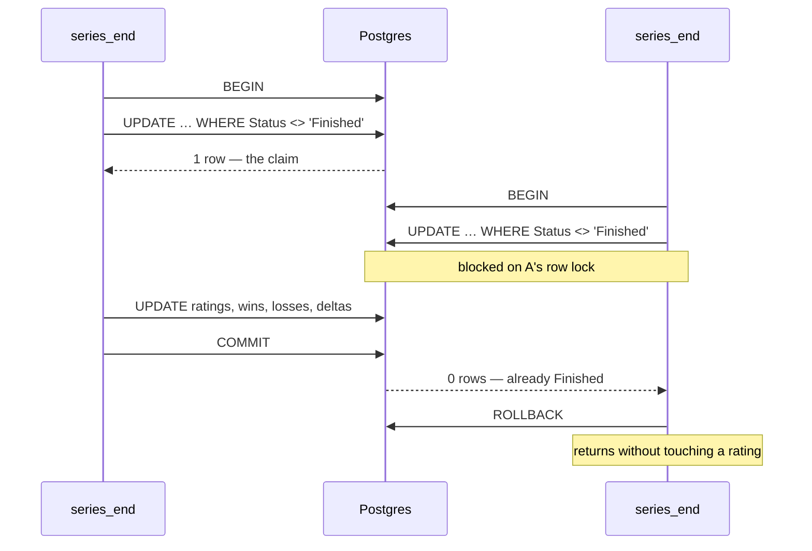

# Rating

What a match is worth, and why.

Until now `Player.Rating` was a number nobody wrote. Matches finished, scores were
saved, and the leaderboard showed the ten seeded demo players forever. This
document is the algorithm that changes that, written down before it was
implemented so the reasoning survives the code.

The code is `backend/Flicked.Api/Services/Rating.cs` (the arithmetic, no database)
and `Services/MatchResults.cs` (the one place a result is ever applied). If the
two disagree with this file, the code is right and this file is stale.

---

## The decision everything else follows from

**The result is the rating. Performance is a correction to it.**

Every ladder that weights statistics heavily ends up measuring statistics. Players
optimise what is measured: they take the fight that pads a K/D instead of the one
that wins the round, they save instead of retaking, they farm damage on a lost
round rather than trading for the plant. This is not a hypothetical — it is the
observed failure mode of every stats-weighted CS ranking, and it is why Valve's
own rank moves on wins and losses.

So the shape here is fixed: an Elo expected-score model on the match result, plus
a **bounded** modifier for how the player did inside it. The bound is not a tuning
knob, it is the whole point. Performance is capped at a quarter of what the result
is worth, and a further rule makes it structurally unable to change the sign:

> **A win never loses you rating. A loss never gains you rating.**

However badly you play, winning moves you up. However well you play, losing moves
you down. The modifier only decides *how far*. That single sentence is what keeps
the incentive pointing at the scoreboard, and it is the property the tests protect.

---

## The formula

For each player in a finished match:

```
E      = 1 / (1 + 10^((opponentMean − rating) / 400))
base   = K × (S − E)
bonus  = K × 0.25 × perf
delta  = round(base + bonus), then forced to at least ±1 in the direction of the result
rating = max(100, rating + delta)
```

| Symbol | Is | Notes |
|---|---|---|
| `rating` | this player's rating before the match | new accounts start at 1000 |
| `opponentMean` | the mean rating of the **other** team | their team, not the whole lobby |
| `E` | expected score, 0…1 | standard Elo, 400-point scale |
| `S` | 1 win, 0 loss, 0.5 draw | the only thing the player controls as a team |
| `K` | 64 sliding to 32 over ten matches | see *New players* |
| `perf` | −1…+1, relative to this match | see *Performance* |

### Why the opponent's mean, and not the lobby's

`E` is a claim: *this rating says you should beat that team this often*. The
evidence for or against it is the other team. Your own teammates' ratings are not
evidence about you, so they do not appear.

The alternative — team mean against team mean, so all five teammates share one
`E` — is tidier and exactly zero-sum, but it rates a 2000-rated player carried by
four 1000s as if they were a 1200 player, and pays them accordingly for beating
1500s. With per-player expectation the strongest player in a lopsided team gains
least for winning and loses most for losing, which is the right direction and is
what makes individual ratings converge on small instances where the draft cannot
always balance.

The cost is that the system is **not exactly zero-sum**. Total rating drifts
slightly when teams are uneven. On a self-hosted instance with a few dozen players
this is invisible next to the noise, and the alternative — a number that is
conserved but wrong about individuals — is the worse trade.

### Why Elo and not Glicko or TrueSkill

Glicko's rating deviation and TrueSkill's σ are the right answer when there is
enough data to estimate them. On an instance with twenty players, RD barely leaves
its initial value, and the machinery costs two extra columns, a migration, a time
decay loop, and a number nobody can explain when they ask why they lost 14 points.

The uncertainty that actually matters here — *this account is new and we have no
idea how good they are* — is captured by the K factor, which is one line. When
FLICKED has enough matches for a deviation to mean something, the base term is a
drop-in replacement: `E` and `S` stay exactly as they are, and only `K` becomes a
function of two deviations instead of one match count.

---

## Performance

`perf` answers one question: **relative to the other nine people in this match,
how did this player do?** Not "how good is this K/D" — relative, always, and to
this match only.

```
rounds     = scoreA + scoreB
duel_i     = (kills_i − deaths_i) / rounds
perf_i     = clamp( 0.5 × (duel_i − mean(duel)) / 0.25
                  + 0.5 × (adr_i  − mean(adr))  / 25 , −1, +1 )
```

Two halves, weighted equally:

- **Duelling**, net kills per round against the match average. `0.25` is the
  reference: a full quarter-kill per round better than everybody else — about six
  net kills over a 24-round match — is a standout game and scores the full half.
- **Damage**, ADR against the match average. `25` ADR clear of the field is the
  same kind of standout, and it is the half that credits the player who does the
  opening damage somebody else converts.

Measuring against the match's own average rather than an absolute standard is
deliberate and does three things at once. It is immune to match length, to a
stomp where everybody's figures are inflated, and to a patch that changes how much
damage weapons do. It also means a player cannot improve their `perf` by picking
easier opponents: everyone is scored against the people who were there.

**Why it is divided by a fixed reference and not the match's standard deviation.**
A z-score would be more statistically honest and is wrong here: with
`Matchmaking:CompetitivePlayers=2` the match has two players, the deviation is
whatever the gap between them happens to be, and every 1v1 ends with both players
at ±1. Fixed references keep a close game close.

**What it is worth.** `K × 0.25`, so ±8 rating for an established player and ±16
for a brand new one. Against a base term of ±32 (±64 provisional), the best game
anybody has ever played is worth a quarter of the result — and the sign rule above
means it is never worth changing the result's direction.

**When it is skipped.** If the match reports fewer than five rounds, `perf` is 0
for everybody and the rating is decided on the result alone. This covers the
degraded path where only `series_end` arrived and the "score" saved is the series
score (`1-0`, one map per match), which would otherwise make the per-round figures
nonsense. It also covers a match abandoned after two rounds.

Stats come from `round_end` and not `map_result` — MatchZy sends an empty players
array in `map_result` (plugin bug #405, see `docs/MATCHZY.md`). If no stats ever
arrived, every player's figures are zero, every mean is zero, every `perf` is 0,
and the system degrades cleanly to plain Elo rather than to nonsense.

---

## New players

`K` starts at 64 and slides linearly to 32 over the first ten matches:

```
K = 32 × (1 + max(0, 10 − matchesPlayed) / 10)
```

| Matches played | K | A coin-flip win is worth |
|---|---|---|
| 0 | 64 | +32 |
| 5 | 48 | +24 |
| 10 or more | 32 | +16 |

A new account's 1000 is a guess, so it should move fast; a veteran's 2400 is the
sum of hundreds of matches, so it should not. Ten matches is short enough that a
genuinely strong player is out of the wrong bracket within an evening, and long
enough that one good night does not mint a Division I player.

**`matchesPlayed` is `Wins + Losses`**, the same two columns this system writes.
There is no separate counter to drift out of step with them, and no migration.

**A provisional player is shown as provisional.** The launcher's leaderboard tags
them, because a rating built from two matches next to one built from three hundred
is the kind of number that is worth an asterisk.

**Deliberately not done:** reducing `K` when the *opponent* is provisional, which
is what Glicko does properly. On a fresh instance everybody is provisional at once,
so it would only mean nothing moves for the first week.

---

## Edges

**The floor is 100.** Rating stops at 100 and losses below it apply nothing. A
rating that can fall forever is not a rank, it is a punishment, and it also breaks
matchmaking: `QueueEntry.ToleranceAt` widens by 25 points every ten seconds, and a
player at −400 can never be bridged to anybody. 100 is far enough below the 1000
start that no honest player reaches it — it is a backstop against a spiral, not a
band anybody is meant to sit in.

**The recorded delta is the applied delta.** When the floor bites, a computed −30
against a rating of 110 is written to `MatchPlayer.RatingDelta` as −10, not −30.
The invariant is that a player's rating equals 1000 plus the sum of their deltas,
so the match history can never tell a story the leaderboard contradicts.

**Draws are real.** MR12 without overtime ends 12-12. `S` is 0.5, neither `Wins`
nor `Losses` moves, and the minimum-change rule does not apply, so two evenly
matched teams drawing move by roughly zero. The match history shows `D`.

**A match with no rounds rates nothing.** 0-0 is a match that did not happen — a
cancelled match a server reported anyway, or a config that never went live.
Ratings, wins and losses are left exactly as they were.

**A match with an empty team rates nothing**, for the same reason: there is no
opponent mean to compute, and there was no contest.

**1v1 and short matches work unchanged.** The instance can run with
`Matchmaking:CompetitivePlayers=2`. A team mean over one player is that player's
rating; `perf` is computed over two players instead of ten and the two of them
come out symmetrical. Nothing in the formula assumes five a side, and nothing in
it assumes the two teams are the same size either.

---

## Applied exactly once

`series_end` can arrive twice. MatchZy does not deduplicate, does not retry, and
does not know whether the last event it sent was received (`docs/MATCHZY.md`).
A rating system that is merely unlikely to double-apply will double-apply.

So the right to apply a result is not a check, it is a **claim on a row**:

```sql
UPDATE "Matches"
   SET "Status" = 'Finished', "ScoreA" = @a, "ScoreB" = @b
 WHERE "Id" = @id AND "Status" <> 'Finished'
```

inside a transaction, with the ratings written in the same transaction and
committed with it. The statement reports how many rows it changed:

- **1** — this call owns the transition. It applies the ratings and commits.
- **0** — somebody else already finished this match. Nothing is written.

Postgres takes a row lock on the match for the duration of the `UPDATE`, so a
duplicate `series_end` arriving at the same instant blocks until the first
transaction commits, then reads the committed `Finished` and changes zero rows.
There is no window between the check and the write, because there is no check:
the same statement that decides is the statement that writes.



This is why `MatchServerController` no longer sets `Status = Finished` itself. If
two places could finish a match, there would be two places that could rate one.
The in-memory `if (match.Status != Finished)` guards at the call sites are kept,
but only as a cheap way to avoid opening a pointless transaction — the database is
the gate, and it is the only gate.

**Cost.** One `UPDATE`, one `SELECT` for the ten `MatchPlayers` with their
`Players` joined, one `SaveChanges` writing at most twenty rows, one `COMMIT`. All
the arithmetic happens in memory between the select and the save. There is no
per-player query anywhere, and there is no second pass.

---

## Worked examples

All figures from the implementation, established players (K = 32) unless stated.

### An even match

Ten players at 1000, Team A wins 13-9. `E = 0.5` for everyone, so `base = ±16`.

| Player | perf | Δ | Why |
|---|---|---|---|
| Winner, average game | 0.0 | **+16** | the result, and nothing else |
| Winner, best on the server | +1.0 | **+24** | +8, the full quarter of K |
| Winner, carried | −1.0 | **+8** | still up: winning is winning |
| Loser, top fragger | +1.0 | **−8** | softened, not reversed |
| Loser, average game | 0.0 | **−16** | |
| Loser, quiet game | −1.0 | **−24** | |

The full spread on the winning side is 8 to 24 points. The difference between the
best and worst *loser* is 16 points; the difference between losing well and
winning badly is nothing at all — the winner takes more. That ordering is the
design.

### The underdog

Team A averages 1000, Team B averages 1400. `E = 0.09` for A, `0.91` for B.

| Outcome | Δ for a 1000 player | Δ for a 1400 player |
|---|---|---|
| A wins | **+29** | **−29** |
| B wins | **−3** | **+3** |

Beating a team 400 points above you is worth ten times beating one at your own
level; beating a team 400 points below you is worth almost nothing, which is what
stops anyone from farming a weaker opponent. Both sides of that are the same
number, because both sides are the same `E`.

### A 1v1 test match

Two players at 1000, `CompetitivePlayers=2`, 13-7 over 20 rounds. The winner goes
13/7 with 95 ADR, the loser 7/13 with 70 ADR.

```
duel:  winner (13−7)/20 = +0.30,  loser −0.30,  match mean 0
       → relative +0.30 and −0.30 → ±0.30/0.25 × 0.5 = ±0.60
adr:   mean 82.5 → relative ±12.5 → ±12.5/25 × 0.5  = ±0.25
perf:  +0.85 and −0.85  →  bonus ±6.8
```

Winner **+23**, loser **−23**. A decisive 1v1 moves more than a scrappy one, and
the two numbers mirror each other because the performance term is relative.

### A first match

A new account at 1000, `K = 64`, wins against a team averaging 1200 with an
average game. `E = 0.24`, `base = 64 × 0.76 = 48.6`.

**+49**, and three matches like it put them in Division IV. That is the point of
the provisional window: a player who does not belong at 1000 should not have to
grind thirty matches to leave it.

### The floor

A player at 110 loses a match worth −30. Rating becomes 100, and the delta written
to the match history is **−10**, not −30, so the history still sums to the rating.

---

## Tests worth having

In `backend/Flicked.Api.Tests/`. The arithmetic ones need no database; the rest run
against real Postgres like the pool and matchmaker suites.

- `E` is 0.5 at equal ratings, and symmetric: `E(a,b) + E(b,a) = 1`.
- A win against stronger opposition gains strictly more than the same win against
  weaker opposition.
- The performance term is bounded: the best imaginable game and the worst
  imaginable game differ by exactly `K/2`, and neither flips the sign of a result.
- The floor holds, and the recorded delta is the applied one.
- A provisional player moves further than an established one for the same match.
- A 1v1 rates both players, symmetrically.
- A match with no rounds, or with an empty team, changes nothing.
- **Applying the same finished match twice changes nothing** — the same
  `series_end` posted again leaves every rating, every win, every loss and every
  delta exactly as the first one left them. This is the test the design exists for.

---

## Deliberately not in the first version

- **Rating decay.** Nobody is inactive yet, and a decay that runs before there is
  a season is just a way to punish people for the project being new.
- **Seasons and resets.** `Season 1` is a label in the launcher today. A reset is a
  soft compression toward 1000 plus an archived table, and it belongs with the
  first real season, not before it.
- **A rank shown to players that is not the raw rating.** `Services/Divisions.cs`
  already maps a rating to a band, and its thresholds are placeholders until there
  are enough real matches to place them. That is the right order: collect the
  distribution, then draw the lines.
- **Rating deviation.** See *Why Elo and not Glicko*. The seam is `K`.
- **Party-adjusted expectation.** A five-stack should be expected to beat five
  solo queuers of the same rating, and one day that belongs in `E`. Parties do not
  exist in the backend yet (`docs/PARTY.md`), so there is nothing to adjust for.
